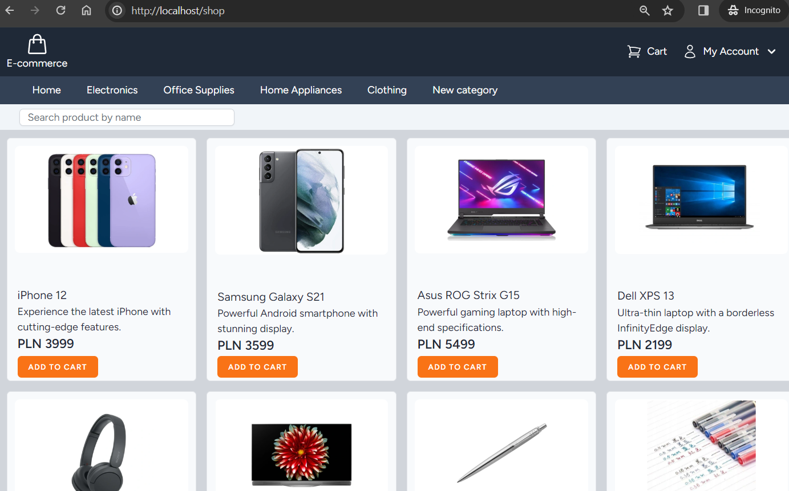
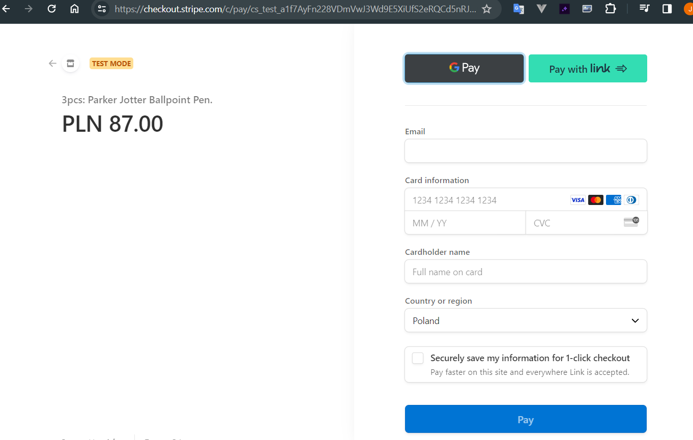
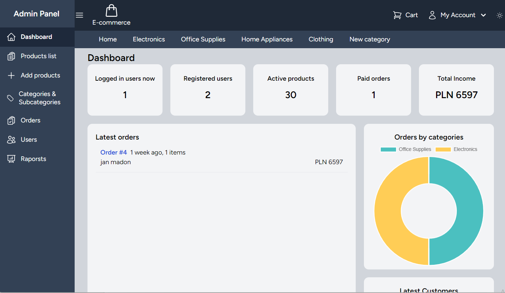
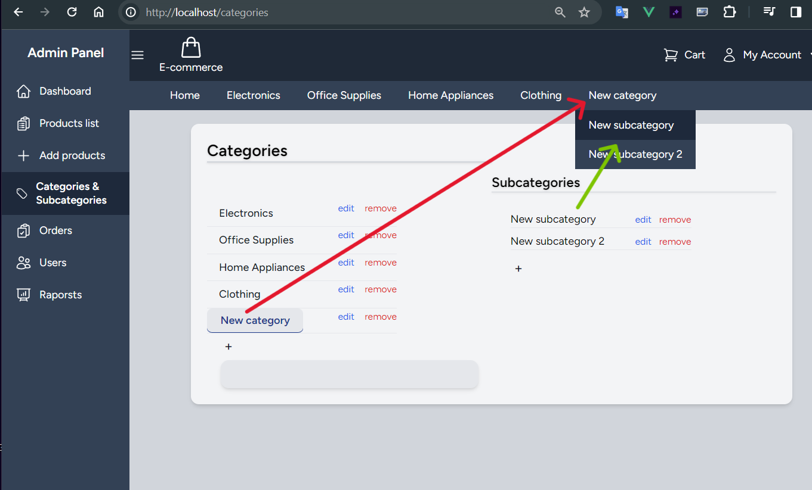

# e-commerce shop

## Description
The e-commerce store offers users easy shopping and provides administrators with tools to manage it. The system allows users to make purchases and payments (test platform) using a card, Google Pay.

The store administrator, in addition to adding products to the store, can create categories and subcategories according to their preferences. Additionally, they have access to the list of portal users, orders, and reports.

## Screenshots

### Main view
 

### Test payment module

### Information on the admin panel

### Category and subcategory structure

## Requirements
    To run this application, you need to have the following installed:

    PHP (recommended version: 8.0 or higher)
    Composer
    Node.js (recommended version: LTS)
    NPM

## Installation Process

### Clone the repository:

    git clone https://github.com/JanMadon/e-commerce.git

### Navigate to the project directory:

    cd e-commerce

### Install PHP dependencies using Composer:
    composer install

### Copy the .env.example file to .env 
    cp .env.example .env

### Generate the Laravel application key:
    php artisan key:generate

### Install JavaScript dependencies using NPM or Yarn:
    npm install

### Compile JavaScript and CSS assets:
    npm run build
    or
    npm run dev

### Run database migrations:
    php artisan migrate

### Start the development server:
    php artisan serve

The application will be accessible at http://localhost:8000.

### Test
    php artisan test

## License

The Laravel framework is open-sourced software licensed under the [MIT license](https://opensource.org/licenses/MIT).
